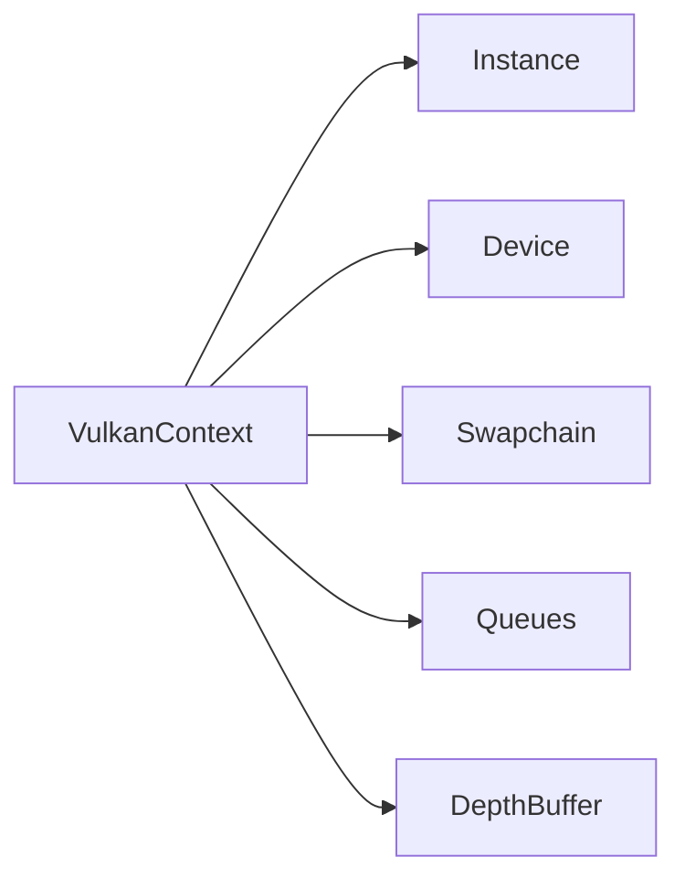
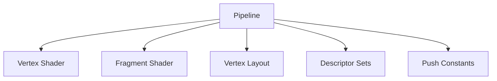
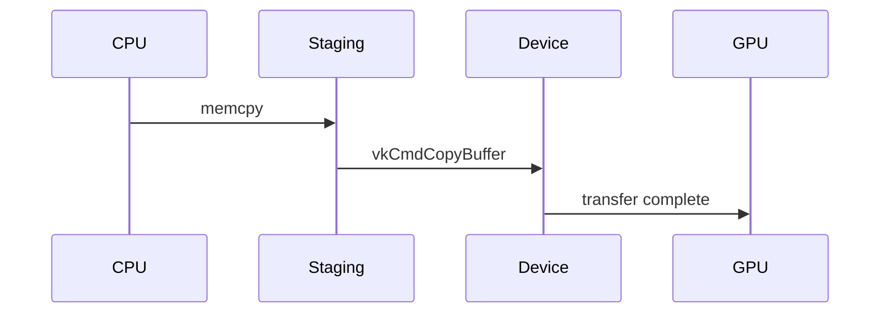
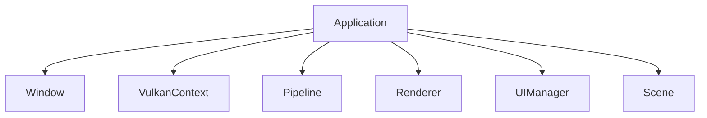

# Core Layer

The core layer provides Vulkan abstraction and GPU resource management.

## Overview

Located in `src/core/`, this layer handles:

- Vulkan initialization
- Swapchain management
- Pipeline creation
- Buffer allocation
- Command buffer recording

## VulkanContext

`vulkan_context.hpp/cpp` - Central Vulkan management class.

### Responsibilities



### Key Methods

```cpp
class VulkanContext {
public:
  VulkanContext(GLFWwindow* window);
  ~VulkanContext();

  // Frame management
  uint32_t beginFrame();
  void endFrame(uint32_t imageIndex);

  // Accessors
  vk::Device device() const;
  vk::Queue graphicsQueue() const;
  vk::CommandBuffer commandBuffer() const;
  vk::Extent2D swapchainExtent() const;
};
```

### Initialization Sequence

1. Create Vulkan instance with validation layers
2. Create surface from GLFW window
3. Select physical device (GPU)
4. Create logical device with required features
5. Create swapchain for presentation
6. Allocate command buffers

### Swapchain Recreation

Handles window resize:

```cpp
void recreateSwapchain() {
  device.waitIdle();
  cleanupSwapchain();
  createSwapchain();
  createDepthBuffer();
  createFramebuffers();
}
```

## Pipeline

`pipeline.hpp/cpp` - Graphics pipeline and descriptor management.

### Pipeline Components



### Descriptor Sets

| Set | Binding | Type | Usage |
|-----|---------|------|-------|
| 0 | 0 | Uniform | View/projection matrices |
| 0 | 1 | Uniform | Model matrix |
| 1 | 0 | Sampler | Texture sampler |
| 1 | 1 | Storage | Bone matrices |

### Push Constants

Used for per-draw data:

```cpp
struct PushConstants {
  glm::mat4 model;
  MaterialData material;
};
```

### Vertex Layout

```cpp
struct Vertex {
  glm::vec3 position;   // location 0
  glm::vec3 normal;     // location 1
  glm::vec2 texCoord;   // location 2
  glm::uvec4 boneIds;   // location 3
  glm::vec4 weights;    // location 4
};
```

## Buffer

`buffer.hpp/cpp` - GPU buffer abstraction.

### Buffer Types

| Type | Memory | Usage |
|------|--------|-------|
| Staging | Host visible | CPU → GPU transfer |
| Vertex | Device local | Vertex data |
| Index | Device local | Index data |
| Uniform | Host visible | Per-frame data |
| Storage | Device local | Bone matrices |

### Usage Pattern

```cpp
// Create buffer with staging upload
Buffer vertexBuffer(
  context,
  vertices.size() * sizeof(Vertex),
  vk::BufferUsageFlagBits::eVertexBuffer,
  vertices.data()
);
```

### Staging Upload



## Renderer

`renderer.hpp/cpp` - Rendering orchestration.

### Frame Structure

```cpp
void Renderer::render(const Scene& scene) {
  auto cmd = context.commandBuffer();

  // Begin dynamic rendering
  beginRendering(cmd);

  // Render scene
  for (const auto& model : scene.models) {
    model.draw(cmd, pipeline);
  }

  // Render UI
  uiManager.render(cmd);

  // End rendering
  endRendering(cmd);
}
```

### Dynamic Rendering

Uses Vulkan 1.3 dynamic rendering (no VkRenderPass):

```cpp
vk::RenderingInfo renderingInfo{
  .renderArea = {{0, 0}, extent},
  .layerCount = 1,
  .colorAttachmentCount = 1,
  .pColorAttachments = &colorAttachment,
  .pDepthAttachment = &depthAttachment
};

cmd.beginRendering(renderingInfo);
```

## Application

`application.hpp/cpp` - Main application class.

### Main Loop

```cpp
void Application::run() {
  while (!window.shouldClose()) {
    glfwPollEvents();

    uint32_t imageIndex = context.beginFrame();

    updateScene();
    renderer.render(scene);

    context.endFrame(imageIndex);
  }
}
```

### Component Ownership



## RenderState

`render_state.hpp` - Centralized render state.

Shared state accessible to all rendering components:

```cpp
struct RenderState {
  glm::mat4 view;
  glm::mat4 projection;
  Camera* camera;
  float deltaTime;
  uint32_t frameNumber;
};
```

## Shader Loading

`shader_loader.hpp` - SPIR-V shader utilities.

Shaders are embedded at compile time:

```cpp
// Generated at build time
extern const uint32_t basic_vert_spv[];
extern const size_t basic_vert_spv_size;

vk::ShaderModule createShaderModule(
  vk::Device device,
  const uint32_t* code,
  size_t size
);
```

## Error Handling

### Validation Layers

Debug builds enable Vulkan validation layers:

```cpp
#ifdef DEBUG
const std::vector<const char*> validationLayers = {
  "VK_LAYER_KHRONOS_validation"
};
#endif
```

### Result Checking

All Vulkan calls are checked:

```cpp
auto [result, value] = device.createBuffer(createInfo);
if (result != vk::Result::eSuccess) {
  throw std::runtime_error("Failed to create buffer");
}
```

## Memory Management

### Vulkan-Hpp RAII

Uses RAII wrappers from Vulkan-Hpp:

```cpp
vk::raii::Buffer buffer{device, createInfo};
vk::raii::DeviceMemory memory{device, allocInfo};
```

Resources automatically destroyed when out of scope.

### Frame Synchronization

Double buffering with semaphores and fences:

```cpp
struct FrameData {
  vk::raii::Semaphore imageAvailable;
  vk::raii::Semaphore renderFinished;
  vk::raii::Fence inFlight;
};
```
