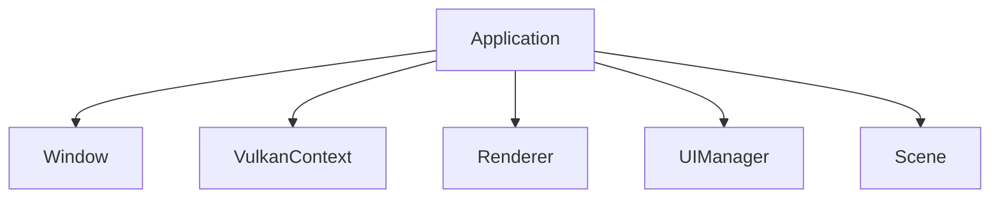

# Core Layer

The core layer provides application orchestration and coordinates between different system components.

## Overview

Located in `src/core/`, this layer handles:

- Application lifecycle (window, main loop)
- Rendering orchestration
- Shared render state
- Shader loading
- Application settings

> **Note:** Reusable Vulkan components (VulkanContext, Buffer, Pipeline, Texture, Camera) have been extracted to `src/lib/gfx/` as part of the library layer. See [Graphics Foundation](#graphics-foundation) below.

## Application

`application.hpp/cpp` - Main application class.

### Responsibilities



### Main Loop

```cpp
void Application::run() {
  while (!window.shouldClose()) {
    glfwPollEvents();

    uint32_t imageIndex = context.beginFrame();

    updateScene();
    renderer.render(scene);

    context.endFrame(imageIndex);
  }
}
```

### Component Ownership

The Application class owns and coordinates:
- Window (GLFW)
- VulkanContext (from `src/lib/gfx/`)
- Renderer
- UIManager
- Scene (from `src/lib/scene/`)

## Renderer

`renderer.hpp/cpp` - Rendering orchestration.

### Frame Structure

```cpp
void Renderer::render(const Scene& scene) {
  auto cmd = context.commandBuffer();

  // Begin dynamic rendering
  beginRendering(cmd);

  // Render scene
  for (const auto& renderable : scene.renderables()) {
    renderable->draw(cmd, pipeline);
  }

  // Render UI
  uiManager.render(cmd);

  // End rendering
  endRendering(cmd);
}
```

### Dynamic Rendering

Uses Vulkan 1.3 dynamic rendering (no VkRenderPass):

```cpp
vk::RenderingInfo renderingInfo{
  .renderArea = {{0, 0}, extent},
  .layerCount = 1,
  .colorAttachmentCount = 1,
  .pColorAttachments = &colorAttachment,
  .pDepthAttachment = &depthAttachment
};

cmd.beginRendering(renderingInfo);
```

## RenderState

`render_state.hpp` - Centralized render state.

Shared state accessible to all rendering components:

```cpp
struct RenderState {
  glm::mat4 view;
  glm::mat4 projection;
  class Camera* camera;  // From src/lib/gfx/
  float deltaTime;
  uint32_t frameNumber;
};
```

## Settings

`settings.hpp/cpp` - Application configuration.

Manages application settings including:
- Texture search paths
- Debug rendering options
- Display preferences

## AppPaths

`app_paths.hpp/cpp` - Platform-specific path resolution.

Provides cross-platform path utilities for:
- Executable directory
- Resource directories
- Configuration directories
- Cache directories

## Shader Loading

`shader_loader.hpp` - SPIR-V shader utilities.

Shaders are embedded at compile time:

```cpp
// Generated at build time
extern const uint32_t basic_vert_spv[];
extern const size_t basic_vert_spv_size;

vk::ShaderModule createShaderModule(
  vk::Device device,
  const uint32_t* code,
  size_t size
);
```

## Graphics Foundation

The following reusable graphics components are located in `src/lib/gfx/`:

### VulkanContext

`src/lib/gfx/vulkan_context.hpp/cpp` - Central Vulkan management class.

- Instance and device creation
- Swapchain management
- Queue handling
- Command buffer allocation
- Depth buffer management

### Pipeline

`src/lib/gfx/pipeline.hpp/cpp` - Graphics pipeline and descriptor management.

- Pipeline creation
- Descriptor set layouts
- Push constant configuration
- Vertex layout definition

### Buffer

`src/lib/gfx/buffer.hpp/cpp` - GPU buffer abstraction.

- Staging buffers (CPU-visible)
- Device-local buffers (GPU-only)
- Automatic buffer transfer

### Camera

`src/lib/gfx/camera.hpp/cpp` - Orbital camera implementation.

- Mouse-controlled orbit
- Zoom with scroll wheel
- View/projection matrix generation

### Texture

`src/lib/gfx/texture.hpp/cpp` - Texture loading and management.

- DDS and TGA format support
- Texture cache
- Mipmap generation

### BoundingBox

`src/lib/gfx/bounding_box.hpp` - Axis-aligned bounding box utilities.

- AABB math operations
- Frustum culling helpers

### Renderable

`src/lib/gfx/renderable.hpp` - Base interface for renderable objects.

```cpp
class IRenderable {
public:
  virtual void draw(vk::CommandBuffer cmd, const Pipeline& pipeline) = 0;
  virtual ~IRenderable() = default;
};
```

## Error Handling

### Validation Layers

Debug builds enable Vulkan validation layers:

```cpp
#ifdef DEBUG
const std::vector<const char*> validationLayers = {
  "VK_LAYER_KHRONOS_validation"
};
#endif
```

### Result Checking

All Vulkan calls are checked:

```cpp
auto [result, value] = device.createBuffer(createInfo);
if (result != vk::Result::eSuccess) {
  throw std::runtime_error("Failed to create buffer");
}
```

## Memory Management

### Vulkan-Hpp RAII

Uses RAII wrappers from Vulkan-Hpp:

```cpp
vk::raii::Buffer buffer{device, createInfo};
vk::raii::DeviceMemory memory{device, allocInfo};
```

Resources automatically destroyed when out of scope.

### Frame Synchronization

Double buffering with semaphores and fences:

```cpp
struct FrameData {
  vk::raii::Semaphore imageAvailable;
  vk::raii::Semaphore renderFinished;
  vk::raii::Fence inFlight;
};
```
