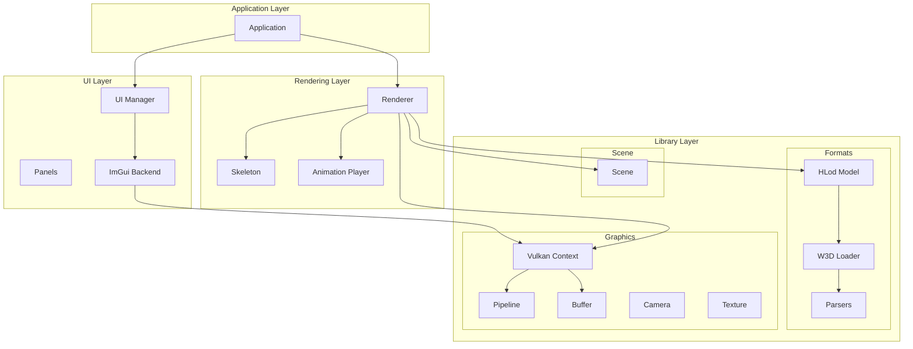
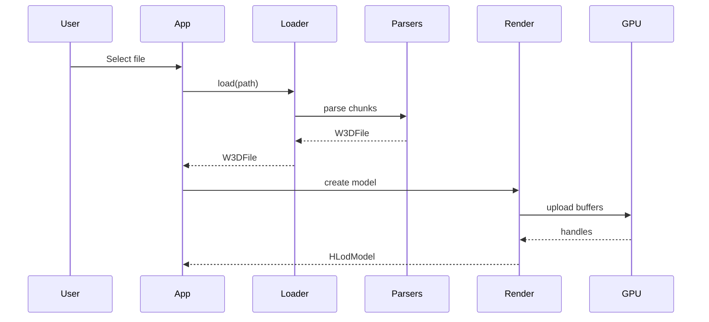

# Architecture

This section provides a technical overview of the VulkanW3DViewer codebase.

## Overview

VulkanW3DViewer is built with a layered architecture that separates concerns:



## Design Principles

### RAII (Resource Acquisition Is Initialization)

All Vulkan resources use RAII wrappers:

- Resources are acquired in constructors
- Resources are released in destructors
- No manual cleanup required
- Exception-safe resource management

### Separation of Concerns

Each layer has a specific responsibility:

| Layer | Responsibility |
|-------|---------------|
| **Core** | Application orchestration, main loop |
| **Library** | Reusable graphics, parsing, and scene components |
| **Render** | Viewer-specific rendering utilities |
| **UI** | User interface, interaction |

The library layer (`src/lib/`) contains components that can be reused in other projects:
- **formats/w3d** - W3D file format parsing
- **gfx** - Vulkan abstraction and GPU resource management
- **scene** - Scene graph management

### Modern C++20

The codebase uses modern C++ features:

- Structured bindings
- Designated initializers
- Concepts and constraints
- `std::span` for buffer views
- `std::optional` for nullable values

## Directory Structure

```
src/
├── main.cpp              # Entry point
├── core/                 # Application orchestration
├── lib/                  # Reusable library components
│   ├── formats/w3d/      # W3D format parsing
│   ├── gfx/              # Graphics foundation
│   └── scene/            # Scene management
├── render/               # Viewer-specific rendering
└── ui/                   # User interface
```

## Sections

<div class="grid cards" markdown>

-   :material-folder-cog:{ .lg .middle } **Project Structure**

    ---

    Detailed breakdown of the source tree

    [:octicons-arrow-right-24: Project Structure](project-structure.md)

-   :material-cube:{ .lg .middle } **Core Layer**

    ---

    Vulkan context, pipelines, and buffers

    [:octicons-arrow-right-24: Core Layer](core-layer.md)

-   :material-file-code:{ .lg .middle } **W3D Parser**

    ---

    W3D file loading and parsing

    [:octicons-arrow-right-24: W3D Parser](w3d-parser.md)

-   :material-image:{ .lg .middle } **Rendering**

    ---

    Model rendering and animation

    [:octicons-arrow-right-24: Rendering](rendering.md)

-   :material-monitor:{ .lg .middle } **UI System**

    ---

    ImGui integration and panels

    [:octicons-arrow-right-24: UI System](ui-system.md)

</div>

## Key Components

### Application

The `Application` class (`src/core/application.hpp`) orchestrates everything:

- Window creation
- Main render loop
- Input handling
- Component lifecycle

### Vulkan Context

The `VulkanContext` class (`src/lib/gfx/vulkan_context.hpp`) manages:

- Instance and device creation
- Swapchain management
- Queue handling
- Command buffer allocation

### W3D Loader

The `Loader` class (`src/lib/formats/w3d/loader.hpp`) provides:

- File reading
- Chunk parsing orchestration
- Data structure population

### Renderer

The `Renderer` class (`src/core/renderer.hpp`) handles:

- Command buffer recording
- Draw call submission
- Frame synchronization

## Data Flow

### Loading a Model



### Rendering a Frame

```mermaid
sequenceDiagram
    participant Loop
    participant Context
    participant Renderer
    participant Model
    participant GPU

    Loop->>Context: begin frame
    Context-->>Loop: command buffer
    Loop->>Renderer: render
    Renderer->>Model: draw
    Model->>GPU: draw calls
    Loop->>Context: end frame
    Context->>GPU: submit
    GPU->>Context: present
```

## Memory Management

### GPU Buffers

- **Staging buffers**: CPU-visible, for data upload
- **Device buffers**: GPU-only, for rendering
- **Uniform buffers**: Per-frame data (camera, transforms)

### Textures

- Loaded on-demand
- Cached by name
- Released when model unloads

## Threading Model

The viewer is primarily single-threaded:

- Main thread: Rendering and UI
- Future: Background loading for large files

## Performance Considerations

### Double Buffering

Frame synchronization uses double buffering to prevent GPU stalls.

### LOD System

HLod models support automatic LOD switching based on screen size.

### Batch Rendering

Meshes are batched where possible to minimize draw calls.
