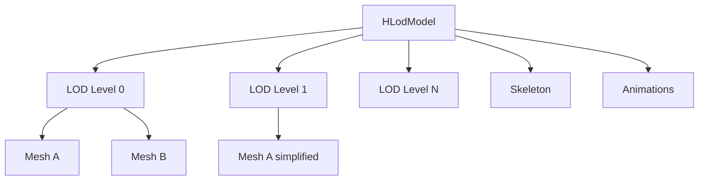
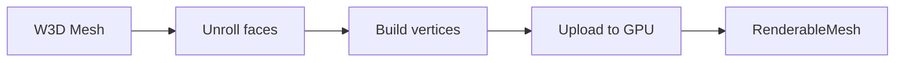

# Rendering

The rendering layer converts W3D data to GPU resources and handles visualization.

## Overview

Rendering functionality is split between two locations:

- **`src/lib/formats/w3d/`** - Reusable W3D model components (HLodModel)
- **`src/lib/gfx/`** - Reusable graphics foundation (Camera, Texture, BoundingBox)
- **`src/render/`** - Viewer-specific rendering utilities

This document covers the viewer-specific rendering utilities in `src/render/`. For graphics foundation components, see [Core Layer](core-layer.md).

## Viewer-Specific Rendering Components

Located in `src/render/`, these components handle the specific rendering needs of the W3D viewer:

- Mesh conversion and GPU upload
- Skeletal animation playback
- Bone transformation buffers
- Raycasting and mesh picking
- Skeleton visualization

## HLodModel

`src/lib/formats/w3d/hlod_model.hpp/cpp` - Multi-LOD model representation.

The HLodModel is now part of the library layer as it represents the core W3D HLod format structure. It can be reused across different applications.

### Structure



### LOD Selection

Automatic LOD based on screen size:

```cpp
int HLodModel::selectLOD(float screenSize) const {
  for (int i = 0; i < lodArrays.size(); i++) {
    if (screenSize <= lodArrays[i].maxScreenSize) {
      return i;
    }
  }
  return lodArrays.size() - 1;  // Lowest detail
}
```

## RenderableMesh

`renderable_mesh.hpp/cpp` - GPU mesh representation.

### GPU Resources

```cpp
class RenderableMesh {
  Buffer vertexBuffer;
  Buffer indexBuffer;
  uint32_t indexCount;

  // Material data
  MaterialData material;
  Texture* texture;
};
```

### Vertex Format

```cpp
struct Vertex {
  glm::vec3 position;    // 12 bytes
  glm::vec3 normal;      // 12 bytes
  glm::vec2 texCoord;    // 8 bytes
  glm::uvec4 boneIds;    // 16 bytes
  glm::vec4 boneWeights; // 16 bytes
};  // Total: 64 bytes
```

### Drawing

```cpp
void RenderableMesh::draw(vk::CommandBuffer cmd) {
  cmd.bindVertexBuffers(0, vertexBuffer.buffer(), {0});
  cmd.bindIndexBuffer(indexBuffer.buffer(), 0, vk::IndexType::eUint32);

  // Push material data
  cmd.pushConstants(layout, vk::ShaderStageFlagBits::eFragment,
                    0, sizeof(MaterialData), &material);

  cmd.drawIndexed(indexCount, 1, 0, 0, 0);
}
```

## MeshConverter

`mesh_converter.hpp/cpp` - W3D to GPU conversion.

### Conversion Process



### Face Unrolling

W3D uses per-face UV indices, requiring vertex duplication:

```cpp
std::vector<Vertex> unrollMesh(const Mesh& mesh) {
  std::vector<Vertex> vertices;

  for (const auto& tri : mesh.triangles) {
    for (int i = 0; i < 3; i++) {
      Vertex v;
      v.position = mesh.vertices[tri.vertexIndices[i]];
      v.normal = mesh.normals[tri.vertexIndices[i]];
      // UV from per-face index
      v.texCoord = mesh.texCoords[perFaceUVs[faceIdx][i]];

      vertices.push_back(v);
    }
  }

  return vertices;
}
```

## Skeleton

`skeleton.hpp/cpp` - Bone pose computation.

### Bone Matrix Calculation

```cpp
glm::mat4 Skeleton::computeBoneMatrix(int boneIndex) {
  const auto& bone = hierarchy.pivots[boneIndex];

  // Local transform
  glm::mat4 local = glm::translate(glm::mat4(1.0f), bone.translation)
                  * glm::mat4_cast(bone.rotation);

  // Multiply by parent
  if (bone.parentIndex != 0xFFFFFFFF) {
    return computeBoneMatrix(bone.parentIndex) * local;
  }

  return local;
}
```

### Pose Update

```cpp
void Skeleton::updatePose(const Animation& anim, float time) {
  for (const auto& channel : anim.channels) {
    float value = interpolate(channel, time);
    applyChannel(channel.pivot, channel.flags, value);
  }

  // Recompute all bone matrices
  computeWorldMatrices();
}
```

## AnimationPlayer

`animation_player.hpp/cpp` - Animation playback control.

### Interface

```cpp
class AnimationPlayer {
public:
  void setAnimation(const Animation* anim);
  void play();
  void pause();
  void stop();

  void setSpeed(float speed);
  void setLoop(bool loop);
  void setFrame(float frame);

  void update(float deltaTime);
  float getCurrentFrame() const;
};
```

### Playback Loop

```cpp
void AnimationPlayer::update(float deltaTime) {
  if (!playing || !animation) return;

  currentTime += deltaTime * speed;

  if (currentTime >= duration) {
    if (loop) {
      currentTime = fmod(currentTime, duration);
    } else {
      currentTime = duration;
      playing = false;
    }
  }
}
```

## BoneBuffer

`bone_buffer.hpp/cpp` - GPU bone matrix storage.

### Buffer Layout

```cpp
struct BoneBufferData {
  glm::mat4 bones[MAX_BONES];  // Typically 256
};
```

### Update

```cpp
void BoneBuffer::update(const Skeleton& skeleton) {
  auto* data = buffer.map();
  for (int i = 0; i < skeleton.boneCount(); i++) {
    data->bones[i] = skeleton.getBoneMatrix(i);
  }
  buffer.unmap();
}
```

## Camera

`src/lib/gfx/camera.hpp/cpp` - Orbital camera implementation.

The Camera class has been extracted to the library layer as it is a reusable component. See [Core Layer - Graphics Foundation](core-layer.md#graphics-foundation) for full documentation.

### State

```cpp
class Camera {
  glm::vec3 target;     // Focal point
  float distance;       // Distance from target
  float azimuth;        // Horizontal angle
  float elevation;      // Vertical angle
  float fov;            // Field of view
};
```

### View Matrix

```cpp
glm::mat4 Camera::viewMatrix() const {
  glm::vec3 position = target + sphericalToCartesian(distance, azimuth, elevation);
  return glm::lookAt(position, target, glm::vec3(0, 1, 0));
}
```

## Texture

`src/lib/gfx/texture.hpp/cpp` - Texture loading and management.

The Texture class has been extracted to the library layer. See [Core Layer - Graphics Foundation](core-layer.md#graphics-foundation) for full documentation.

### Texture Cache

```cpp
class TextureManager {
  std::unordered_map<std::string, Texture> cache;

public:
  Texture* get(const std::string& name);
  void preload(const std::vector<std::string>& names);
};
```

### Supported Formats

| Format | Extension | Notes |
|--------|-----------|-------|
| TGA | `.tga` | Most common |
| DDS | `.dds` | Compressed |

## SkeletonRenderer

`skeleton_renderer.hpp/cpp` - Debug bone visualization.

Renders bones as lines connecting parent to child:

```cpp
void SkeletonRenderer::render(const Skeleton& skeleton) {
  for (const auto& bone : skeleton.bones()) {
    if (bone.parentIndex != ROOT) {
      drawLine(bone.worldPosition,
               skeleton.bones()[bone.parentIndex].worldPosition,
               boneColor);
    }
  }
}
```

## Material

`material.hpp` - Material data for shaders.

```cpp
struct MaterialData {
  glm::vec4 ambient;
  glm::vec4 diffuse;
  glm::vec4 specular;
  glm::vec4 emissive;
  float shininess;
  float opacity;
  uint32_t flags;
};
```
