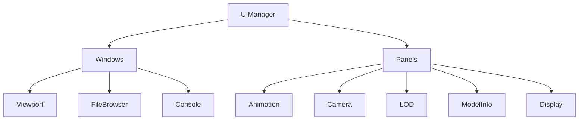

# UI System

The UI layer provides the user interface using Dear ImGui.

## Overview

Located in `src/ui/`, this layer provides:

- ImGui Vulkan integration
- Window and panel management
- Input handling
- Debug visualization

## ImGui Backend

`imgui_backend.hpp/cpp` - Vulkan integration for ImGui.

### Initialization

```cpp
class ImGuiBackend {
public:
  ImGuiBackend(VulkanContext& context, GLFWwindow* window);
  ~ImGuiBackend();

  void newFrame();
  void render(vk::CommandBuffer cmd);
};
```

### Rendering Pipeline

```mermaid
sequenceDiagram
    participant Loop
    participant Backend
    participant ImGui
    participant Vulkan

    Loop->>Backend: newFrame()
    Backend->>ImGui: ImGui_ImplVulkan_NewFrame()
    Backend->>ImGui: ImGui_ImplGlfw_NewFrame()
    Backend->>ImGui: ImGui::NewFrame()

    Note over Loop: UI code runs here

    Loop->>Backend: render(cmd)
    Backend->>ImGui: ImGui::Render()
    Backend->>Vulkan: Draw commands
```

### Font Loading

```cpp
void ImGuiBackend::loadFonts() {
  auto& io = ImGui::GetIO();
  io.Fonts->AddFontFromFileTTF("fonts/Roboto-Regular.ttf", 16.0f);

  // Upload to GPU
  ImGui_ImplVulkan_CreateFontsTexture();
}
```

## UI Manager

`ui_manager.hpp/cpp` - Component management.

### Structure



### Lifecycle

```cpp
class UIManager {
public:
  UIManager(UIContext& context);

  void update();   // Process input, update state
  void render();   // Draw all UI

  // Window access
  template<typename T>
  T* getWindow();
};
```

### Frame Update

```cpp
void UIManager::update() {
  // Update all windows
  for (auto& window : windows) {
    if (window->isVisible()) {
      window->update();
    }
  }

  // Update all panels
  for (auto& panel : panels) {
    if (panel->isVisible()) {
      panel->update();
    }
  }
}
```

## UI Context

`ui_context.hpp` - Shared state for UI components.

```cpp
struct UIContext {
  // Application state
  HLodModel* currentModel;
  Camera* camera;
  AnimationPlayer* animPlayer;

  // UI state
  bool showSkeleton;
  bool showBoundingBox;
  bool showWireframe;
  int forcedLOD;

  // Selection
  std::string hoveredMesh;

  // Console
  std::vector<std::string> consoleLines;
  void log(const std::string& message);
};
```

## Base Classes

### UIWindow

`ui_window.hpp` - Base for floating windows.

```cpp
class UIWindow {
public:
  virtual ~UIWindow() = default;

  virtual void update() = 0;
  virtual void render() = 0;

  bool isVisible() const { return visible; }
  void setVisible(bool v) { visible = v; }

protected:
  std::string title;
  bool visible = true;
  ImGuiWindowFlags flags = 0;
};
```

### UIPanel

`ui_panel.hpp` - Base for dockable panels.

```cpp
class UIPanel {
public:
  virtual ~UIPanel() = default;

  virtual void update() = 0;
  virtual void render() = 0;

  const std::string& name() const { return panelName; }

protected:
  std::string panelName;
  UIContext& context;
};
```

## Windows

### Viewport Window

`viewport_window.hpp/cpp` - 3D rendering viewport.

Handles:

- Viewport rendering area
- Mouse input for camera
- Hover detection display

```cpp
void ViewportWindow::render() {
  ImGui::Begin("Viewport", nullptr, flags);

  // Get available size
  ImVec2 size = ImGui::GetContentRegionAvail();

  // Render 3D content to texture
  renderToTexture(size);

  // Display as ImGui image
  ImGui::Image(viewportTexture, size);

  // Handle input if window focused
  if (ImGui::IsWindowFocused()) {
    handleInput();
  }

  ImGui::End();
}
```

### File Browser

`file_browser.hpp/cpp` - File selection dialog.

```cpp
void FileBrowser::render() {
  ImGui::Begin("File Browser");

  // Path bar
  renderPathBar();

  // File list
  for (const auto& entry : currentDirectory) {
    if (entry.isDirectory()) {
      if (ImGui::Selectable(entry.name().c_str(), false,
                            ImGuiSelectableFlags_AllowDoubleClick)) {
        if (ImGui::IsMouseDoubleClicked(0)) {
          navigateTo(entry);
        }
      }
    } else if (entry.extension() == ".w3d") {
      if (ImGui::Selectable(entry.name().c_str())) {
        onFileSelected(entry.path());
      }
    }
  }

  ImGui::End();
}
```

### Console Window

`console_window.hpp/cpp` - Debug output.

```cpp
void ConsoleWindow::render() {
  ImGui::Begin("Console");

  // Scrolling region
  ImGui::BeginChild("ScrollRegion", ImVec2(0, 0), false,
                    ImGuiWindowFlags_HorizontalScrollbar);

  for (const auto& line : context.consoleLines) {
    ImGui::TextUnformatted(line.c_str());
  }

  // Auto-scroll
  if (autoScroll && ImGui::GetScrollY() >= ImGui::GetScrollMaxY()) {
    ImGui::SetScrollHereY(1.0f);
  }

  ImGui::EndChild();
  ImGui::End();
}
```

## Panels

### Animation Panel

`panels/animation_panel.hpp/cpp`

```cpp
void AnimationPanel::render() {
  if (ImGui::CollapsingHeader("Animation", ImGuiTreeNodeFlags_DefaultOpen)) {
    // Animation selection
    if (ImGui::BeginCombo("Animation", currentAnim.c_str())) {
      for (const auto& anim : animations) {
        if (ImGui::Selectable(anim.name.c_str())) {
          context.animPlayer->setAnimation(&anim);
        }
      }
      ImGui::EndCombo();
    }

    // Playback controls
    if (ImGui::Button(playing ? "Pause" : "Play")) {
      playing ? context.animPlayer->pause() : context.animPlayer->play();
    }

    // Speed control
    ImGui::SliderFloat("Speed", &speed, 0.0f, 2.0f);

    // Timeline
    float frame = context.animPlayer->getCurrentFrame();
    if (ImGui::SliderFloat("Frame", &frame, 0, maxFrames)) {
      context.animPlayer->setFrame(frame);
    }
  }
}
```

### Camera Panel

`panels/camera_panel.hpp/cpp`

- FOV slider
- Near/far plane controls
- Position display (read-only)

### Display Panel

`panels/display_panel.hpp/cpp`

- Wireframe toggle
- Skeleton visualization toggle
- Bounding box toggle
- Grid toggle

### LOD Panel

`panels/lod_panel.hpp/cpp`

- Current LOD display
- Auto/manual LOD selection
- Force LOD dropdown

### Model Info Panel

`panels/model_info_panel.hpp/cpp`

- Model name
- Mesh count and names
- Vertex/triangle counts
- Bone count
- Texture list

## Hover Tooltip

`hover_tooltip.hpp/cpp` - Mesh hover display.

```cpp
void HoverTooltip::render() {
  if (!context.hoveredMesh.empty()) {
    ImGui::BeginTooltip();
    ImGui::Text("Mesh: %s", context.hoveredMesh.c_str());
    ImGui::EndTooltip();
  }
}
```

## Styling

ImGui uses a dark theme configured at startup:

```cpp
void setupStyle() {
  ImGuiStyle& style = ImGui::GetStyle();

  // Dark colors
  style.Colors[ImGuiCol_WindowBg] = ImVec4(0.1f, 0.1f, 0.1f, 0.95f);
  style.Colors[ImGuiCol_Header] = ImVec4(0.2f, 0.2f, 0.2f, 1.0f);

  // Rounded corners
  style.WindowRounding = 4.0f;
  style.FrameRounding = 2.0f;
}
```
