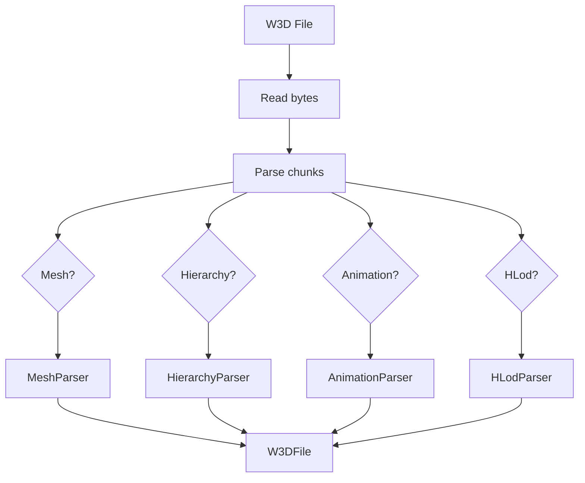
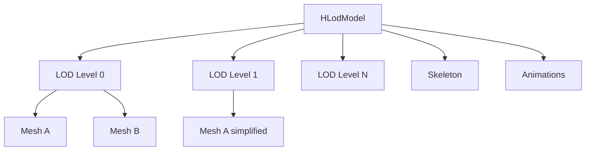

# W3D Parser

The W3D parsing layer handles loading and interpreting W3D format files.

## Overview

Located in `src/lib/formats/w3d/`, this layer provides:

- Binary file reading
- Chunk-based parsing
- Data structure population

This is part of the reusable library layer and can be used independently of the viewer application.

## Module Header

`w3d.hpp` provides a convenience include:

```cpp
#include "formats/w3d/w3d.hpp"  // Includes all W3D types
```

## Chunk Reader

`chunk_reader.hpp` - Low-level binary parsing utilities.

### Chunk Structure

Every W3D chunk has this header:

```cpp
struct ChunkHeader {
  uint32_t type;     // ChunkType enum value
  uint32_t size;     // Size in bytes (high bit = container)
};
```

The high bit of `size` indicates a container chunk:

```cpp
constexpr uint32_t CONTAINER_BIT = 0x80000000;

bool isContainer = (size & CONTAINER_BIT) != 0;
uint32_t dataSize = size & ~CONTAINER_BIT;
```

### ChunkReader Class

```cpp
class ChunkReader {
public:
  ChunkReader(std::span<const uint8_t> data);

  // Read primitives
  template<typename T>
  T read();

  // Read arrays
  template<typename T>
  std::vector<T> readArray(size_t count);

  // Read string (null-terminated, fixed length)
  std::string readString(size_t maxLen);

  // Navigate chunks
  bool hasMore() const;
  ChunkHeader peekChunk();
  void skipChunk(const ChunkHeader& header);
  ChunkReader subReader(const ChunkHeader& header);
};
```

### Reading Pattern

```cpp
ChunkReader reader(fileData);

while (reader.hasMore()) {
  auto header = reader.peekChunk();

  switch (static_cast<ChunkType>(header.type)) {
    case ChunkType::MESH:
      parseMesh(reader.subReader(header));
      break;
    default:
      reader.skipChunk(header);
  }
}
```

## Loader

`loader.hpp/cpp` - File loading orchestrator.

### Interface

```cpp
namespace w3d {

W3DFile load(const std::filesystem::path& path);
W3DFile load(std::span<const uint8_t> data);

}
```

### Loading Process



## Parsers

### MeshParser

`mesh_parser.hpp/cpp` - Parses mesh chunks.

Handles these chunk types:

| Chunk | Content |
|-------|---------|
| `MESH` | Container for mesh data |
| `MESH_HEADER3` | Mesh metadata |
| `VERTICES` | Vertex positions |
| `VERTEX_NORMALS` | Normal vectors |
| `TRIANGLES` | Face indices |
| `TEXCOORDS` | UV coordinates |
| `VERTEX_INFLUENCES` | Bone weights |
| `MATERIAL_INFO` | Material counts |
| `TEXTURES` | Texture references |

### HierarchyParser

`hierarchy_parser.hpp/cpp` - Parses skeleton data.

| Chunk | Content |
|-------|---------|
| `HIERARCHY` | Container |
| `HIERARCHY_HEADER` | Bone count, name |
| `PIVOTS` | Bone transforms |
| `PIVOT_FIXUPS` | Correction vectors |

### AnimationParser

`animation_parser.hpp/cpp` - Parses animation data.

| Chunk | Content |
|-------|---------|
| `ANIMATION` | Uncompressed animation |
| `COMPRESSED_ANIMATION` | Compressed animation |
| `ANIMATION_CHANNEL` | Keyframe data |
| `BIT_CHANNEL` | Visibility data |

### HLodParser

`hlod_parser.hpp/cpp` - Parses LOD configuration.

| Chunk | Content |
|-------|---------|
| `HLOD` | Container |
| `HLOD_HEADER` | LOD count, names |
| `HLOD_LOD_ARRAY` | LOD level meshes |
| `HLOD_SUB_OBJECT` | Mesh reference |

### HLodModel

`hlod_model.hpp/cpp` - Multi-LOD model representation.

The HLodModel has been extracted to `src/lib/formats/w3d/` as it is a core W3D format component that can be reused across different applications.



| Chunk | Content |
|-------|---------|
| `HLOD` | Container |
| `HLOD_HEADER` | LOD count, names |
| `HLOD_LOD_ARRAY` | LOD level meshes |
| `HLOD_SUB_OBJECT` | Mesh reference |

## Data Types

`types.hpp` - W3D data structures.

### Mesh

```cpp
struct Mesh {
  MeshHeader header;

  // Geometry
  std::vector<Vector3> vertices;
  std::vector<Vector3> normals;
  std::vector<Vector2> texCoords;
  std::vector<Triangle> triangles;

  // Skinning
  std::vector<VertexInfluence> vertexInfluences;

  // Materials
  std::vector<TextureDef> textures;
  std::vector<MaterialPass> materialPasses;
};
```

### Hierarchy

```cpp
struct Hierarchy {
  std::string name;
  std::vector<Pivot> pivots;  // Bones
};

struct Pivot {
  std::string name;
  uint32_t parentIndex;  // 0xFFFFFFFF = root
  Vector3 translation;
  Quaternion rotation;
};
```

### Animation

```cpp
struct Animation {
  std::string name;
  std::string hierarchyName;
  uint32_t numFrames;
  uint32_t frameRate;
  std::vector<AnimChannel> channels;
};

struct AnimChannel {
  uint16_t pivot;       // Bone index
  uint16_t flags;       // Channel type (X, Y, Z, Q)
  std::vector<float> data;
};
```

### HLod

```cpp
struct HLod {
  std::string name;
  std::string hierarchyName;
  std::vector<HLodArray> lodArrays;
};

struct HLodArray {
  float maxScreenSize;  // Switch threshold
  std::vector<HLodSubObject> subObjects;
};
```

## Chunk Types

`chunk_types.hpp` - Chunk type enumeration.

```cpp
enum class ChunkType : uint32_t {
  // Mesh chunks
  MESH = 0x00000000,
  VERTICES = 0x00000002,
  // ... many more

  // Hierarchy chunks
  HIERARCHY = 0x00000100,

  // Animation chunks
  ANIMATION = 0x00000200,

  // HLod chunks
  HLOD = 0x00000700,
};
```

## Error Handling

### Invalid Files

```cpp
if (!isValidW3D(data)) {
  throw std::runtime_error("Invalid W3D file format");
}
```

### Missing Chunks

Non-critical chunks can be missing:

```cpp
if (mesh.texCoords.empty()) {
  // Generate default UVs
  mesh.texCoords.resize(mesh.vertices.size(), {0, 0});
}
```

### Version Checking

```cpp
if (header.version > W3D_CURRENT_MESH_VERSION) {
  // Warn but continue
  std::cerr << "Newer mesh version: " << header.version << "\n";
}
```

## Format Quirks

See [W3D Format](../w3d-format/index.md) for detailed format documentation.

Key quirks handled by the parser:

1. **UV V-Flip**: V coordinates are inverted
2. **Quaternion Order**: W3D uses (x,y,z,w), GLM uses (w,x,y,z)
3. **Per-Face UVs**: Requires mesh "unrolling"
4. **Root Bone**: Parent index 0xFFFFFFFF indicates root
