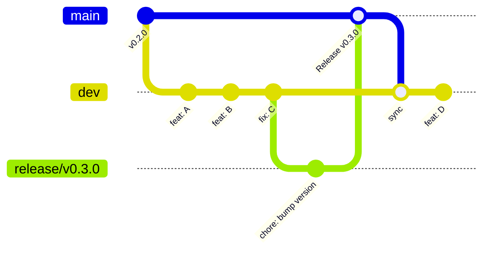

# Branching Strategy

This project uses a **release-branch flow** designed to keep `main` always reflecting the latest release while allowing continuous development on `dev`.

## Branch Roles

| Branch | Purpose | Merges from | Merges to |
|--------|---------|-------------|-----------|
| `main` | Latest release only | `release/*` via PR | Synced back to `dev` |
| `dev` | Next release accumulator | `feature/*`, `fix/*` via PR | Cut `release/*` branches |
| `feature/*`, `fix/*` | Individual work items | Branched from `dev` | PR to `dev` |
| `release/vX.Y.Z` | Release stabilization | Cut from `dev` | PR to `main` |

## Flow Diagram



## Rules

1. **Never push directly to `main` or `dev`** -- all changes arrive via pull requests.
2. **Flow is one-directional:** `feature` -> `dev` -> `release` -> `main` -> (sync back to `dev`).
3. **After every release merge**, `main` is automatically synced back to `dev` via the `sync-dev.yml` workflow. This prevents merge conflicts.
4. **Release branches are short-lived** -- days, not weeks. Cut them when `dev` is ready, stabilize quickly, merge to `main`.

## Development Workflow

### Working on a Feature or Fix

```bash
# Start from dev
git checkout dev
git pull origin dev

# Create your branch
git checkout -b feature/add-texture-filtering

# ... develop, commit ...

# Push and open a PR targeting dev
git push -u origin feature/add-texture-filtering
```

Open a PR from `feature/add-texture-filtering` to `dev`. The PR test matrix and clang-format will run automatically.

### Cutting a Release

When `dev` has accumulated enough changes for a release:

```bash
# Start from dev
git checkout dev
git pull origin dev

# Create the release branch (must follow vX.Y.Z naming)
git checkout -b release/v0.3.0
```

On the release branch:

1. **Bump the version** in `CMakeLists.txt` (the `project(... VERSION X.Y.Z ...)` line).
2. Apply only bugfixes if issues are found during testing.
3. Push and open a PR targeting `main`.

```bash
git push -u origin release/v0.3.0
```

### What Happens on Merge

When the release PR is merged to `main`, three things happen automatically:

1. **`auto-tag.yml`** creates a git tag `vX.Y.Z` from the release branch name.
2. **`release.yml`** triggers on the new tag, builds Linux and Windows binaries, and creates a GitHub Release with artifacts and changelog.
3. **`sync-dev.yml`** merges `main` back into `dev` to keep them aligned. If there are conflicts (rare), it creates a PR for manual resolution instead.

## Version Naming

- Tags follow the format `vX.Y.Z` (e.g., `v0.3.0`)
- Pre-release suffixes are supported: `v0.3.0-alpha`, `v0.3.0-beta`
- Tags containing `alpha` or `beta` are automatically marked as pre-releases on GitHub
- The version in `CMakeLists.txt` should match the base version (without the `v` prefix or pre-release suffix)

## CI/CD Workflows

| Workflow | Trigger | Purpose |
|----------|---------|---------|
| `pr-test.yml` | PRs to `dev`, `main`, `release/**` | Multi-platform test matrix (Linux GCC/Clang, Windows MSVC/Clang) |
| `clang-format.yaml` | All PRs | Auto-format C/C++ files |
| `auto-tag.yml` | Release PR merged to `main` | Creates git tag from release branch name |
| `release.yml` | Tag push (`v*`) | Builds artifacts and creates GitHub Release |
| `sync-dev.yml` | Push to `main` | Merges `main` back into `dev` |
| `docs.yml` | Push to `main` (docs paths) | Deploys documentation site |
