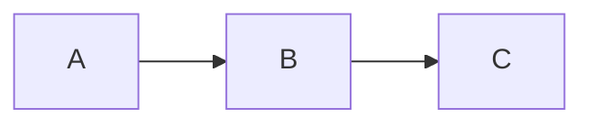

# Publishing Documentation

This guide explains how to publish and maintain the documentation site.

## Overview

The documentation is built with [MkDocs](https://www.mkdocs.org/) using the [Material theme](https://squidfunk.github.io/mkdocs-material/). It's automatically deployed to GitHub Pages when changes are pushed to the `main` branch.

## Automatic Deployment

Documentation is automatically published via GitHub Actions when:

- Changes are pushed to `main` branch affecting `docs/` or `mkdocs.yml`
- The workflow is manually triggered

The workflow file is located at `.github/workflows/docs.yml`.

## Initial GitHub Pages Setup

If GitHub Pages isn't configured yet:

1. Go to your repository on GitHub
2. Navigate to **Settings** > **Pages**
3. Under **Build and deployment**:
   - **Source**: Select "GitHub Actions"
4. Save the settings

The next push to `main` with documentation changes will trigger deployment.

## Local Development

### Prerequisites

Install the required Python packages:

```bash
pip install -r docs/requirements.txt
```

### Live Preview

Start a local development server with live reload:

```bash
mkdocs serve
```

Open http://127.0.0.1:8000 in your browser. Changes to documentation files are reflected immediately.

### Build Locally

Build the static site without serving:

```bash
mkdocs build
```

The output is generated in the `site/` directory (gitignored).

### Strict Mode

Check for broken links and warnings:

```bash
mkdocs build --strict
```

This will fail if there are any warnings, useful for CI validation.

## Manual Deployment

If you need to deploy manually (not recommended for normal use):

```bash
mkdocs gh-deploy
```

This builds the site and pushes to the `gh-pages` branch.

!!! warning "Prefer Automatic Deployment"
    Manual deployment bypasses CI checks. Use the automatic GitHub Actions workflow for production deployments.

## Documentation Structure

```
docs/
├── index.md                    # Landing page
├── requirements.txt            # Python dependencies
├── stylesheets/
│   └── extra.css               # Custom styling
├── getting-started/            # Installation & setup
├── user-guide/                 # End-user documentation
├── architecture/               # Technical architecture
├── w3d-format/                 # W3D format specification
├── development/                # Developer guides
└── api/                        # API reference
```

## Adding New Pages

1. Create a new `.md` file in the appropriate directory
2. Add the page to `mkdocs.yml` under the `nav` section:

```yaml
nav:
  - Section Name:
    - section/index.md
    - New Page: section/new-page.md  # Add this
```

3. Preview locally with `mkdocs serve`
4. Commit and push to `main`

## Writing Guidelines

### Markdown Features

The Material theme supports extended Markdown:

**Admonitions** (callout boxes):

```markdown
!!! note "Title"
    Content here

!!! warning
    Warning content

!!! tip
    Helpful tip
```

**Code blocks with titles**:

````markdown
```python title="example.py"
def hello():
    print("Hello")
```
````

**Tabbed content**:

```markdown
=== "Tab 1"
    Content for tab 1

=== "Tab 2"
    Content for tab 2
```

**Mermaid diagrams**:

````markdown

````

### Style Guide

- Use sentence case for headings
- Keep lines under 100 characters when practical
- Use code blocks for all code, commands, and file paths
- Include examples for complex features
- Link to related documentation pages

## Troubleshooting

### Build Fails with Warnings

Run `mkdocs build --strict` locally to see warnings. Common issues:

- Broken internal links (check file paths)
- Missing pages listed in `nav`
- Invalid YAML in `mkdocs.yml`

### Pages Not Updating

1. Check GitHub Actions workflow status
2. Verify changes are on `main` branch
3. Clear browser cache or try incognito mode
4. GitHub Pages can take a few minutes to update

### Local Server Won't Start

```bash
# Ensure dependencies are installed
pip install -r docs/requirements.txt

# Check for port conflicts
mkdocs serve -a 127.0.0.1:8001  # Use different port
```

## Configuration Reference

Key settings in `mkdocs.yml`:

| Setting | Purpose |
|---------|---------|
| `site_name` | Site title in header |
| `site_url` | Production URL (for sitemap) |
| `repo_url` | GitHub repository link |
| `theme.palette` | Color scheme settings |
| `nav` | Navigation structure |
| `plugins` | MkDocs plugins |
| `markdown_extensions` | Markdown feature extensions |

See the [MkDocs Material documentation](https://squidfunk.github.io/mkdocs-material/) for all available options.
