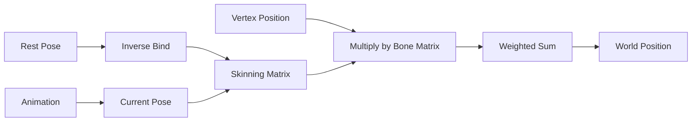

# Hierarchies

W3D skeleton/bone hierarchy format documentation.

## Overview

Hierarchies define the bone structure for skeletal animation. Each bone (called a "pivot" in W3D) has a local transform and parent reference.

## Hierarchy Structure

```
HIERARCHY (0x00000100) - Container
├── HIERARCHY_HEADER (0x00000101)
├── PIVOTS (0x00000102)
└── PIVOT_FIXUPS (0x00000103) - Optional
```

## Hierarchy Header

`HIERARCHY_HEADER` (0x00000101)

```cpp
struct HierarchyHeader {
  uint32_t version;       // Format version
  char name[16];          // Hierarchy name
  uint32_t numPivots;     // Number of bones
  Vector3 center;         // Center point
};
```

## Pivots (Bones)

`PIVOTS` (0x00000102) - Array of pivot data

Each pivot is 60 bytes:

```cpp
struct PivotData {
  char name[16];           // Bone name
  uint32_t parentIndex;    // Parent bone index (0xFFFFFFFF = root)
  Vector3 translation;     // Local position
  Vector3 eulerAngles;     // Euler rotation (often unused)
  Quaternion rotation;     // Local rotation
};
```

### Reading Pivots

```cpp
std::vector<Pivot> readPivots(ChunkReader& reader, uint32_t count) {
  std::vector<Pivot> pivots(count);

  for (uint32_t i = 0; i < count; i++) {
    pivots[i].name = reader.readString(16);
    pivots[i].parentIndex = reader.read<uint32_t>();
    pivots[i].translation = reader.read<Vector3>();
    pivots[i].eulerAngles = reader.read<Vector3>();
    pivots[i].rotation = reader.read<Quaternion>();
  }

  return pivots;
}
```

### Root Bone

The root bone has `parentIndex = 0xFFFFFFFF`:

```cpp
bool isRoot(const Pivot& pivot) {
  return pivot.parentIndex == 0xFFFFFFFF;
}
```

A hierarchy may have multiple roots.

## Pivot Fixups

`PIVOT_FIXUPS` (0x00000103) - Array of Vector3

Optional correction vectors applied after computing bone matrices:

```cpp
struct PivotFixup {
  Vector3 offset;
};

// Applied as:
finalMatrix = boneMatrix * translate(fixup);
```

## Quaternion Format

W3D stores quaternions as (x, y, z, w):

```cpp
struct W3DQuaternion {
  float x, y, z, w;
};
```

GLM uses (w, x, y, z):

```cpp
glm::quat convertQuaternion(const W3DQuaternion& q) {
  return glm::quat(q.w, q.x, q.y, q.z);
}
```

## Computing World Matrices

### Local to World

```cpp
glm::mat4 computeWorldMatrix(
    const std::vector<Pivot>& pivots,
    int boneIndex,
    std::vector<glm::mat4>& cache
) {
  if (cache[boneIndex] != glm::mat4(0)) {
    return cache[boneIndex];
  }

  const Pivot& pivot = pivots[boneIndex];

  // Build local transform
  glm::mat4 local = glm::translate(glm::mat4(1.0f),
      glm::vec3(pivot.translation.x, pivot.translation.y, pivot.translation.z));
  local *= glm::mat4_cast(convertQuaternion(pivot.rotation));

  // Multiply by parent
  if (pivot.parentIndex != 0xFFFFFFFF) {
    local = computeWorldMatrix(pivots, pivot.parentIndex, cache) * local;
  }

  cache[boneIndex] = local;
  return local;
}
```

### Rest Pose

The rest pose (bind pose) is computed from the hierarchy data without any animation:

```cpp
void computeRestPose(
    const Hierarchy& hierarchy,
    std::vector<glm::mat4>& worldMatrices
) {
  worldMatrices.resize(hierarchy.pivots.size(), glm::mat4(0));

  for (size_t i = 0; i < hierarchy.pivots.size(); i++) {
    computeWorldMatrix(hierarchy.pivots, i, worldMatrices);
  }
}
```

## Inverse Bind Matrices

For skinning, you need inverse bind matrices:

```cpp
void computeInverseBindMatrices(
    const std::vector<glm::mat4>& restPose,
    std::vector<glm::mat4>& inverseBindMatrices
) {
  inverseBindMatrices.resize(restPose.size());

  for (size_t i = 0; i < restPose.size(); i++) {
    inverseBindMatrices[i] = glm::inverse(restPose[i]);
  }
}
```

## Skinning Pipeline



Skinning matrix calculation:

```cpp
glm::mat4 skinningMatrix = currentPose * inverseBindPose;
```

## Bone Naming Convention

W3D uses consistent naming conventions:

| Prefix | Meaning |
|--------|---------|
| `B_` | Bone |
| `ROOT` | Root transform |
| `ROOTTRANSFORM` | Root transform (alternate) |

Common bone names:

- `B_SPINE` - Spine bone
- `B_HEAD` - Head bone
- `B_LARM`, `B_RARM` - Left/right arm
- `B_LLEG`, `B_RLEG` - Left/right leg
- `B_WEAPON` - Weapon attachment point
- `B_TURRET` - Vehicle turret

## Hierarchy in HLod

Hierarchies are referenced by HLod structures:

```cpp
struct HLod {
  std::string hierarchyName;  // References Hierarchy.name
  // ...
};
```

The HLod connects meshes to bones via `boneIndex` in sub-objects.

## Multiple Hierarchies

A W3D file can contain multiple hierarchies:

- Main skeleton
- Alternative poses
- Different animation targets

The correct hierarchy is matched by name.

## Debugging

Visualize the skeleton:

```cpp
void renderSkeleton(const Hierarchy& hierarchy,
                    const std::vector<glm::mat4>& worldMatrices) {
  for (size_t i = 0; i < hierarchy.pivots.size(); i++) {
    const auto& pivot = hierarchy.pivots[i];

    // Draw bone as point
    drawPoint(worldMatrices[i] * glm::vec4(0, 0, 0, 1));

    // Draw line to parent
    if (pivot.parentIndex != 0xFFFFFFFF) {
      drawLine(
        worldMatrices[i] * glm::vec4(0, 0, 0, 1),
        worldMatrices[pivot.parentIndex] * glm::vec4(0, 0, 0, 1)
      );
    }
  }
}
```
